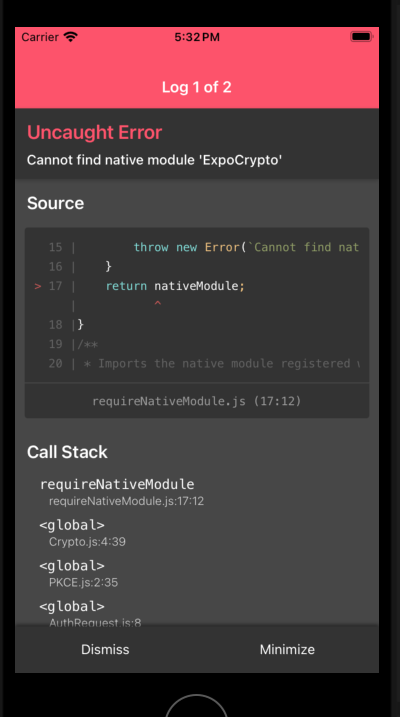

# Repro

Repro demonstrating a monorepo with pnpm, tamagui, and expo.
Breaks on adding clerk-expo for authentication.
[Discord Forum explaining the issue](https://discord.com/channels/695411232856997968/1243659928208408586)

## Problem Statement

When I checkout the `feature/auth` branch and run `pnpm expo ios`,
I expect a simulator to start, install the compiled binary, and the app starts without problem,
but the app starts and hits a runtime error
> Cannot find native module `ExpoCrypto`

## Setup

Install dependencies

```
pnpm i
```

## Observe working

Build a simulator build with either

```
pnpm expo ios
pnpm expo android
```

## Observe issue

Checkout `feature/auth`
This branch starts the bare minimum work for adding authentication with [Clerk](https://clerk.com/docs/quickstarts/expo).

Update dependencies with `pnpm i`.
Again build a simulator build with 

```
pnpm expo ios
pnpm expo android
```

You do not need to update the env file with your clerk api key - The app fails to start up because the app doesn't have expo-crypto in its bundle.



This is brought in as a peer dependency from expo-auth-session, which itself is a peer dependency of @clerk/clerk-expo.

